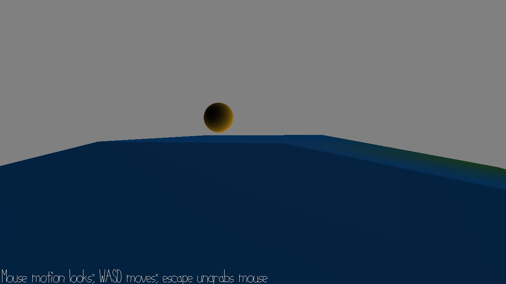

# 15-466 Game 5: Around the World

Author: Jason Xu

Design: A game where you walk around a spherical world and find an object, which can be done by tracing the source of the soundtrack.

Screen Shot:

How To Play:

Using the default WASD keys and mouse, the player should walk around the world in any direction to try to locate the gold sphere denoting the goal. The gold sphere plays 3D sound in the space, and the player can find the goal tracing the source of the sound. Headphones or good speakers are recommended.

Sources: This game was built with Game 3 and 5 base code. Assets were self-made. Soundtrack is "Soaring" by Kevin MacLeod, licensed under CC BY 3.0. I collaborated with Ashley Kim and Joyce Zhang on the WalkMesh tutorial and code.

This game was built with [NEST](NEST.md).

